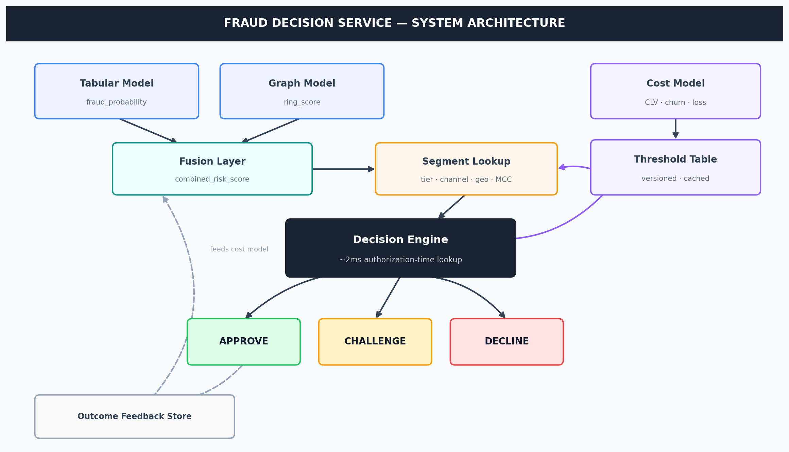
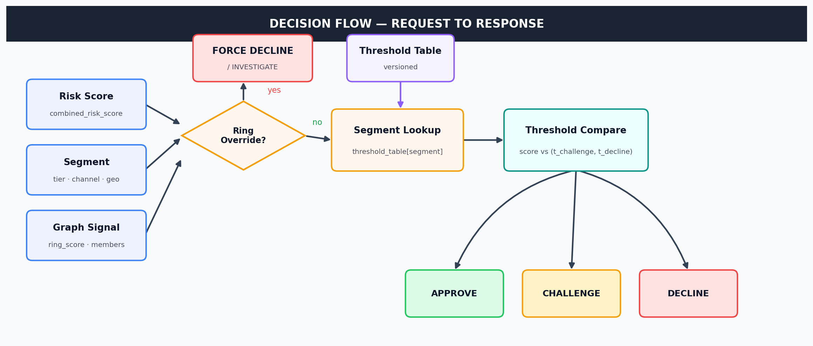
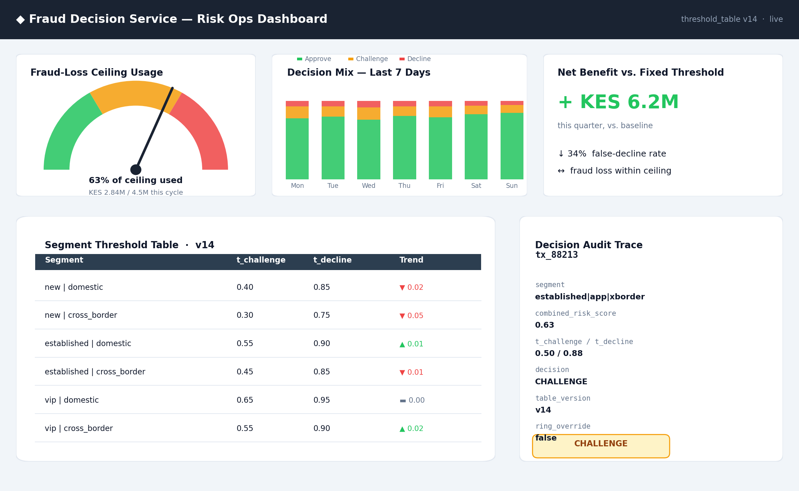

# Fraud Decision Service

**A production-grade, cost-sensitive decisioning layer that replaces fixed fraud thresholds with segment-aware, profit-optimized decisions.**

[]()
[]()
[]()
[]()
[]()

---

## Table of Contents

- [The Problem This Solves](#the-problem-this-solves)
- [Architecture](#architecture)
- [Decision Flow](#decision-flow)
- [Key Capabilities](#key-capabilities)
- [Project Structure](#project-structure)
- [Build Sequence](#build-sequence)
- [Deployment](#deployment)
- [Quick Start](#quick-start)
- [API Reference](#api-reference)
- [Monitoring](#monitoring)
- [Business Impact Equation](#business-impact-equation)
- [Testing](#testing)
- [Requirements](#requirements)
- [Contributing](#contributing)

---

## The Problem This Solves

Most fraud systems optimize for **accuracy** — but accuracy treats every error as equally costly. It isn't.

| Error Type | What Actually Happens | Typical Cost |
|---|---|---|
| **False Negative** (fraud approved) | Direct fraud loss, chargebacks, network penalties | High, but bounded to the transaction amount |
| **False Positive** (legitimate transaction declined) | Customer friction, cart abandonment, churn | Often **higher** — one declined customer may stop transacting entirely |

A single global threshold silently assumes every customer and every transaction has the same cost structure. They don't. A VIP customer with three years of clean history and a KES 500 purchase has a completely different false-positive cost than a brand-new account attempting a KES 180,000 cross-border transaction.

This service replaces that placeholder with an explicit, tunable, auditable decision layer that asks one question:

> *"Given this risk score, and given what it costs to be wrong in either direction, what's the optimal action?"*

---

## Architecture



The service sits **downstream** of your existing risk models — it does not replace them. The tabular model's `fraud_probability` and the graph model's `ring_score` are fused upstream into a single `combined_risk_score`; this service decides what to *do* with that score, using a segment-specific, cost-optimized threshold table rather than one global cutoff. Confirmed outcomes flow back into the cost model, closing the loop.

---

## Decision Flow



Every request passes through a **hard override check** first: an account tied to a confirmed fraud ring (`ring_score > 0.90` with ≥ 2 confirmed members) is force-declined regardless of the cost-sensitive logic below it. Everything else is resolved by comparing `combined_risk_score` against that segment's `(t_challenge, t_decline)` pair, read from an in-memory, versioned threshold table.

---

## Key Capabilities

### 1. Segment-Aware Thresholds

Instead of one global threshold, each segment gets its own optimized pair:

| Segment | t_challenge | t_decline |
|---|---|---|
| new \| domestic | 0.40 | 0.85 |
| new \| cross_border | 0.30 | 0.75 |
| established \| domestic | 0.55 | 0.90 |
| established \| cross_border | 0.45 | 0.85 |
| vip \| domestic | 0.65 | 0.95 |
| vip \| cross_border | 0.55 | 0.90 |

### 2. Cost Model

```
FN_cost = transaction_amount + chargeback_fee + network_penalty_risk
FP_cost = lost_margin + P(churn | decline) × CLV + support_cost
CH_cost = P(abandonment | challenge) × margin + operational_cost
```

`P(churn | decline)` and `CLV` come from real survival/churn models fit per segment — not global constants. See `test_churn_model.py` for the churn-model contract this service assumes.

### 3. Optimization Engine

| Method | Description | When to Use |
|---|---|---|
| **Grid Search** | Sweep thresholds per segment, pick the best under the fraud-loss ceiling | Ship first — auditable, simple, works today |
| **Joint Optimizer** | Reallocates fraud-loss budget across segments jointly | After validation — e.g. VIP friction is more expensive than fraud in new accounts |

Covered by `test_optimizer.py` and `test_joint_optimizer.py`.

### 4. Reliability Layer

| Failure | Fallback |
|---|---|
| Threshold table stale or unreachable | Last-known-good table |
| Segment has insufficient outcome data | Parent / coarser segment threshold |
| Churn or CLV model degrades | Freeze thresholds, alert — never silently keep optimizing on bad inputs |
| Candidate table fails backtest | Reject, keep serving the previous version |

Covered by `test_reliability.py`.

### 5. Decision Latency

| Path | Budget | Contents |
|---|---|---|
| Authorization-time (hot) | **~2 ms** | Segment key lookup + threshold read + comparison |
| Threshold refresh (warm) | Minutes | Aggregate outcomes, recompute cost-model inputs |
| Full re-optimization (cold) | Daily–weekly | Full grid search, canary-validate, publish |

Covered by `test_decision_engine.py`.

---

## Project Structure

```
fraud-decision-service/
├── src/                        # Core service code (decision engine, cost model, optimizer, outcome store)
├── config/                     # Segment definitions, cost-model config
├── deploy/                     # Windows deployment scripts
│   ├── start_production.bat
│   ├── health_check.bat
│   ├── rollback.bat
│   ├── monitor.ps1
│   ├── shadow_runner.py
│   ├── pilot_runner.py
│   └── production_config.json
├── run.py                      # Service entry point
├── audit_system.py             # Decision audit trace utility
├── run_all_tests.py            # Test runner
├── test_decision_engine.py
├── test_optimizer.py
├── test_joint_optimizer.py
├── test_churn_model.py
├── test_reliability.py
├── DEPLOYMENT_CHECKLIST.md     # Full pre/post-deployment checklist
└── README_DEPLOYMENT.md        # Deployment quick reference
```

See [`README_DEPLOYMENT.md`](README_DEPLOYMENT.md) for the deployment quick reference and [`DEPLOYMENT_CHECKLIST.md`](DEPLOYMENT_CHECKLIST.md) for the full pre/post-deployment checklist, including rollback triggers and post-deployment monitoring cadence.

---

## Build Sequence

```
┌────────────────────────────────────────────────────────────────┐
│ Sprint 1 · Outcome Feedback Pipeline                            │
│   Capture is_false_decline and churned_after_decline signals    │
├────────────────────────────────────────────────────────────────┤
│ Sprint 2 · Coarse Cost Model + Grid Search                      │
│   Placeholder costs → grid search → first threshold table       │
├────────────────────────────────────────────────────────────────┤
│ Sprint 3 · Decision Engine Integration                          │
│   Replace fixed threshold with segment-aware lookup             │
├────────────────────────────────────────────────────────────────┤
│ Sprint 4 · Reliability Layer                                    │
│   Fallback logic, table versioning, canary gate                 │
├────────────────────────────────────────────────────────────────┤
│ Sprint 5 · Real Cost-Model Inputs                                │
│   Fit churn/CLV models → replace placeholder constants          │
├────────────────────────────────────────────────────────────────┤
│ Sprint 6 · Joint Optimizer                                      │
│   Reallocate fraud-loss budget across segments                  │
└────────────────────────────────────────────────────────────────┘
```

---

## Deployment

```
Phase 1 · Shadow Mode        deploy\shadow_runner.py
  Run parallel with the existing fixed threshold, no live impact

Phase 2 · Pilot Segment      deploy\pilot_runner.py
  Cut over one low-risk, high-volume segment first; monitor daily

Phase 3 · Full Rollout       deploy\start_production.bat
  Extend to all segments, with monitoring and instant rollback
```

Rollback (`deploy\rollback.bat`) restores the previous threshold table version — not a code deploy. Rollback triggers, health checks, and the full post-deployment monitoring schedule are documented in [`DEPLOYMENT_CHECKLIST.md`](DEPLOYMENT_CHECKLIST.md).

---

## Quick Start

```bat
:: Clone and navigate
git clone https://github.com/MfalmeML/fraud-decision-service.git
cd fraud-decision-service

:: Install dependencies
pip install -r requirements.txt

:: Run tests
python run_all_tests.py

:: Audit system
python audit_system.py

:: Start the service
deploy\start_production.bat

:: Verify health
deploy\health_check.bat

:: Monitor
powershell -ExecutionPolicy Bypass -File deploy\monitor.ps1
```

Configuration lives in `deploy\production_config.json` (threshold table, fraud ceiling, logging level, fallback settings). Logs are written to `logs/decision.log`.

---

## API Reference

| Method | Path | Purpose |
|---|---|---|
| `POST` | `/decide` | Make a decision |
| `POST` | `/outcome` | Record a confirmed outcome |
| `POST` | `/publish` | Publish a new threshold table |
| `GET` | `/health` | Health check |
| `GET` | `/thresholds/{segment}` | Get current thresholds for a segment |
| `GET` | `/outcome?transaction_id=&label=` | Retrieve a recorded outcome |

### Decision Request

```json
POST /decide
{
  "combined_risk_score": 0.63,
  "segment": {
    "customer_tier": "established",
    "channel": "app",
    "geography": "cross_border"
  },
  "ring_score": 0.0,
  "confirmed_members": 0
}
```

### Decision Response

```json
{
  "decision": "CHALLENGE",
  "threshold_table_version": "2026-08-30T00:00Z-v14",
  "segment_matched": "established|app|electronics|cross_border",
  "t_challenge": 0.50,
  "t_decline": 0.88,
  "override": false
}
```

### Example: sending a test decision (PowerShell)

```powershell
Invoke-RestMethod -Method Post -Uri http://localhost:8080/decide `
  -Body '{"combined_risk_score":0.5,"segment":{"customer_tier":"established","geography":"domestic"}}' `
  -ContentType 'application/json'
```

---

## Monitoring



The risk ops dashboard surfaces everything a reviewer needs without touching a database directly:

- **Fraud-loss ceiling usage** — how much of the current cycle's budget has been spent
- **Decision mix** — approve / challenge / decline rates over time, by segment
- **Net benefit** — realized business impact versus the fixed-threshold baseline
- **Segment threshold table** — current values, with trend indicators between refreshes
- **Decision audit trace** — full reasoning for any single transaction, via `audit_system.py` or `GET /outcome`

Post-deployment monitoring cadence (hourly fraud loss and false-decline rate, weekly cost-model drift checks, monthly segment review) is documented in [`DEPLOYMENT_CHECKLIST.md`](DEPLOYMENT_CHECKLIST.md).

---

## Business Impact Equation

```
Net Benefit =

    (Revenue recovered from reduced false declines)
  + (CLV preserved from customers not unnecessarily churned)
  − (Additional fraud loss incurred, if any)
  − (Additional challenge / friction operational cost)
  − (Infrastructure and maintenance cost)

  vs. baseline (fixed global threshold)
```

The system is justified only if it demonstrably reduces false-positive-driven revenue and CLV loss by more than any increase in fraud loss or operational cost.

---

## Testing

| Test File | Coverage |
|---|---|
| `test_decision_engine.py` | `/decide` end-to-end, ring-override precedence, segment lookup |
| `test_optimizer.py` | Grid-search threshold selection under the fraud-loss ceiling |
| `test_joint_optimizer.py` | Cross-segment budget reallocation |
| `test_churn_model.py` | Cost-model inputs — churn probability, CLV estimation |
| `test_reliability.py` | Fallback logic, table versioning, canary gate |
| `run_all_tests.py` | Runs the full suite |

```bat
python run_all_tests.py
python audit_system.py
```

Rollback triggers used in production (fraud loss exceeding ceiling by 10%, false-decline rate up >20% vs. baseline, latency >5ms for 3 consecutive checks, 5xx rate >1%) are defined in [`DEPLOYMENT_CHECKLIST.md`](DEPLOYMENT_CHECKLIST.md).

---

## Requirements

- Python 3.8+
- Dependencies: `pandas`, `scipy`, `numpy`
- Windows (deployment scripts are `.bat` / PowerShell; see `deploy/`)

---

## License

MIT

---

## Contributing

1. Fork the repository
2. Create a feature branch
3. Commit your changes
4. Run the full test suite: `python run_all_tests.py`
5. Open a pull request

---

## Authors

Fraud Decision Service Team

---

*"A fixed threshold is not a decision policy — it's a placeholder that happens to work until someone asks why 0.5?"*
